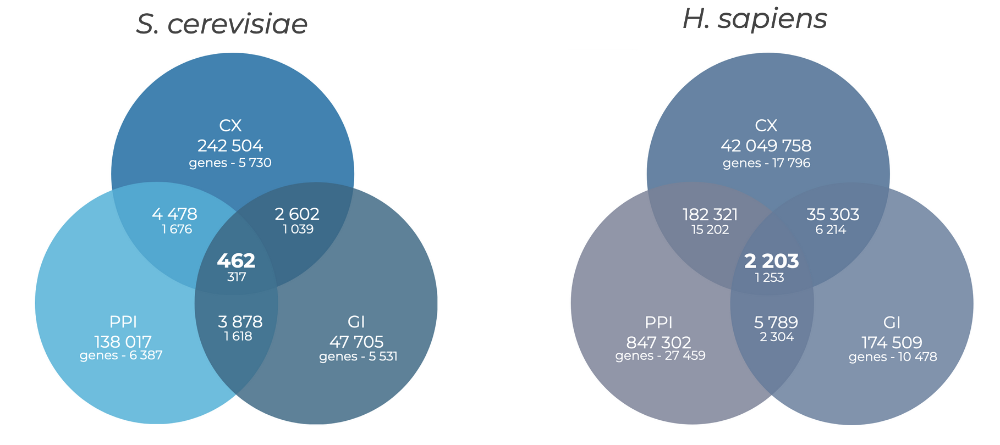
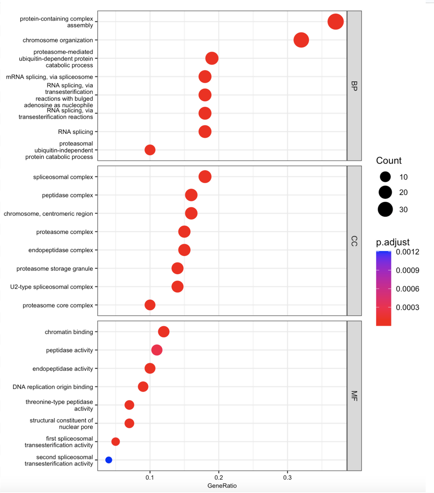
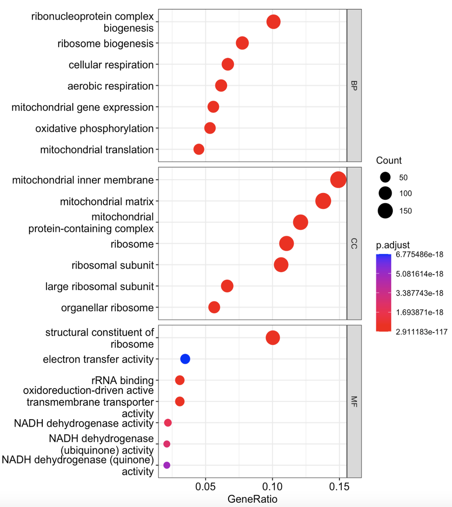
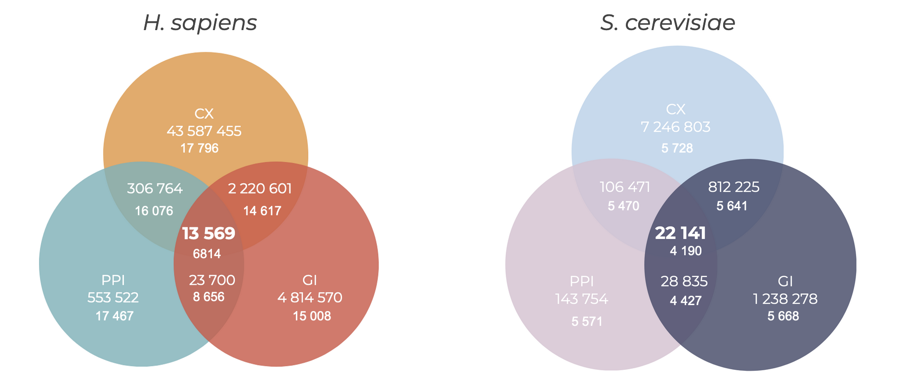

# Interactions in multi-layer biological networks

Supervisor: Yury Barbioff, Institute of Bioinformatics Research & Education (IBRE)

Aim: explore correspondence between interactions in different biological networks (PPI, GI, CX)* for yeast and human. Find common patterns between organisms

*_PPI - protein-protein interactions, GI - gene interactions, CX - co-expression data_

Objectives:
- Network data acquisition and preprocessing 
- Analysis of PPI, GI, CX 
- Investigation of the correspondence between interactions in these networks 
- Enrichment analysis of genes involved in common interactions of all networks
- Comparison of results between other organisms

## Code
The basic analysis code is presented in `analysis.Rmd`. The code contains the installation of all necessary packages. But just in case something goes wrong, I attach `sessionInfo.txt`

Please note that the code contains the download of all the required files and these files take about 7-8 GB. Also, processing this data involves removing duplicates, which takes quite a long time. 

Graph illustration and clustering is done by the [safepy](https://github.com/baryshnikova-lab/safepy) tool which is still in development. In this regard, its installation is possible only manually by the following steps: 

```
git clone https://github.com/baryshnikova-lab/safepy.git
cd safepy/
virtualenv -p python3 safepy_env
source safepy_env/bin/activate
pip install -r requirements.txt
```

The code using safepy in the file `safepy_script.ipynb`.

The modularity metrics are calculated in `modularity.ipynb`. However, to run this script you need to update networkx to version 3.1. So I suggest to create another environment with requirements_mod.txt installation

### Databases 
For yeast, data were obtained from databases such as [TheCellMap](https://thecellmap.org/costanzo2016/) (GI), [BioGRID](https://thebiogrid.org/) (PPI), and [YeastNet](https://www.inetbio.org/yeastnet/) (CX). For humans, [HumanNet](https://staging2.inetbio.org/humannetv3/) (GI), [BioGRID](https://thebiogrid.org/) (PPI), [GeneMANIA](http://genemania.org/) (CX).


## Results
For each organism, we obtained an intersection of all layers and identified 462 interactions common to all 3 networks for yeast, represented by 317 genes, and 2203 interactions for humans, represented by 1253 genes.



The next step of our study was to analyze the enrichment of genes involved in common interactions. As a result of this analysis for yeast genes, we obtained enrichment of translation processes, chromosome organization, the cell cycle, and other processes associated with complex intermolecular structures.



The results of the enrichment analysis for human genes were similar. However, in humans we also find enrichment of processes related to mitochondrial function. We suggest that this is related to the metabolic features of yeast, which can live without mitochondria at all. Thus, we see that on all three layers of our network we find genes involved in the processes that support the vital activity of the cell.



We also performed a similar analysis on data from the GeneMANIA database, which includes the results of a large number of studies, in addition to data from screening studies. As a result, we obtained 13569 common interactions for humans, represented by 6814 genes, and 22141 common interactions for yeast, involving 4190 genes. Enrichment analysis on these networks led to the same results, which further confirms our conclusions.



In conclusion, the processes that sustain a living cell and are necessary for survival require coordinated work on all three layers for both single-celled and multicellular organisms.

